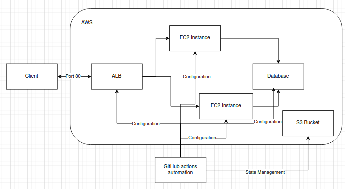
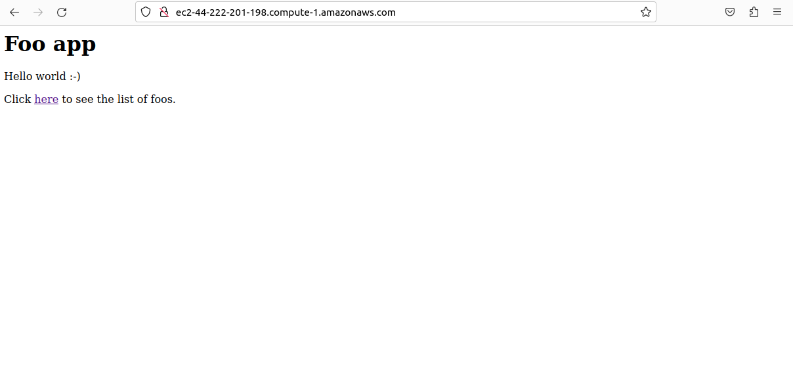
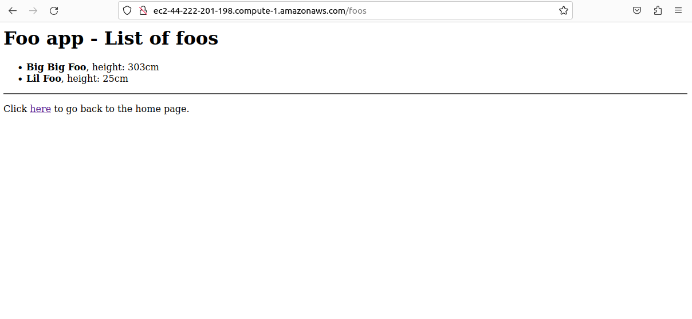

# COSC2759 Assignment 2

## Student details

- Student 1: Sandrian Wardana
- Student ID: s4115489

- Student 2: Sulthan Prabowo
- Student ID: s4115594

## Solution design
The problem is solved by using a combination of AWS, EC2, Ansible, and Terraform to deploy the web application. AWS is used for quick deployment, along with EC2. Ansible is used to automate the scripts. Terraform is to establish connection AWS itself.

### Infrastructure

- **VPC and Subnets**: A Virtual Private Cloud (VPC) with public and private subnets to host the application and database instances.
- **Load Balancer**: An Application Load Balancer to distribute traffic across the app instances.
- **NAT Gateway**: For allowing instances in the private subnet to access the internet.
- **Key Pair**: An SSH key pair for accessing the instances, created during the deployment process.

#### Key data flows

1. **User Requests**: Users send requests to the Load Balancer, which distributes the traffic to the app instances.
2. **App to Database**: The app instances communicate with the database instance over a private network.
3. **App Clone**: The app clone instance is used for redundancy and load balancing.

### Deployment process

#### Prerequisites
What you will need are:
- An AWS account.
- A running AWS lab.
- A GitHub account.
- A docker file.
- A pair of SSHs keys (automatically created when user runs 'deploy.sh')
- GitHub secrets to store AWS lab session credentials.

#### Description of the GitHub Actions workflow
1. On push onto the main branch, the GitHUb workflow runs.
2. It will run on Ubuntu, then install dependencies.
3. Next, it will setup AWS CLI and GitHub secrets will be used to store AWS credentials.
4. Terraform will be installed next to automate AWS connections.
5. 'deploy.sh' will run as the last step, which will deploy the web app.
6. If the build fails, it will automatically destroy the AWS servers using Terraform destroy.

#### Backup process: deploying from a shell script
The file 'deploy.sh' can be run manually to automate Ansible, and Terraform scripts to run the web server in a local machine.

#### Validating that the app is working
1. **Load balancer**: Ensuring that the application is distributing traffic correctly across instances.
2. **Logs**: Check the logs to ensure everything is up to par.

## Contents of this repo
1. Github workflow folder.
2. Ansible: Directory containing Ansible playbooks and configuration files.
3. app/: Directory containing the application code.
4. deploy.sh: Shell script to deploy the application.
5. infra/: Directory containing Terraform configuration files.

